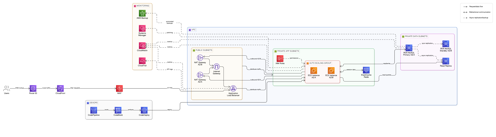

```markdown
# AWS Well-Architected Framework (WAF) & Cloud Adoption Framework (CAF) Assessment

## 📌 Overview

This repository contains a structured evaluation and improved architectural design for migrating a two-tier web application (frontend + backend database) from on-premises infrastructure to AWS Cloud.

The assessment applies:

- AWS Well-Architected Framework (WAF)
- AWS Cloud Adoption Framework (CAF)

The goal is to ensure the cloud migration aligns with AWS best practices across security, reliability, operational excellence, performance efficiency, and cost optimization.

# AWS Well-Architected Framework (WAF) & Cloud Adoption Framework (CAF) Assessment

## 📌 Overview

This repository contains a structured evaluation and improved architectural design for migrating a two-tier web application (frontend + backend database) from on-premises infrastructure to AWS Cloud.

The assessment applies:

- AWS Well-Architected Framework (WAF)
- AWS Cloud Adoption Framework (CAF)

The goal is to ensure the cloud migration aligns with AWS best practices across security, reliability, operational excellence, performance efficiency, and cost optimization.

---

## 📂 Repository Structure

aws-waf-caf-assessment/
├── README.md  
├── aws_waf_caf_assessment.md  
├── architecture-diagram.png (or .drawio)  
└── submission-details.md

---

## 🧠 Approach

1. Reviewed the existing two-tier architecture.
2. Identified potential risks and weaknesses.
3. Evaluated the workload using the five WAF pillars.
4. Assessed organizational readiness using the six CAF perspectives.
5. Designed an improved architecture aligned with AWS best practices.

---

## 🏗️ Key AWS Services Used

- Amazon VPC
- Amazon EC2
- Auto Scaling Group
- Application Load Balancer
- Amazon RDS (Multi-AZ)
- Amazon ElastiCache (Redis)
- Amazon CloudFront
- AWS WAF

# AWS Well-Architected Framework (WAF) & Cloud Adoption Framework (CAF) Assessment

## 📌 Overview

This repository contains a structured evaluation and improved architectural design for migrating a two-tier web application (frontend + backend database) from on-premises infrastructure to AWS Cloud.

The assessment applies:

- AWS Well-Architected Framework (WAF)
- AWS Cloud Adoption Framework (CAF)

The goal is to ensure the cloud migration aligns with AWS best practices across security, reliability, operational excellence, performance efficiency, and cost optimization.

---

## 🏛️ Architecture (diagram)



_Diagram: `img.png` — shows VPC with public/private subnets, ALB, ASG, RDS (Multi-AZ), ElastiCache, CloudFront + WAF, CloudWatch & CloudTrail._

If you prefer the editable source, see `architecture-diagram.drawio`.

---

## 📂 Repository Structure

aws-waf-caf-assessment/
├── README.md  
├── aws_waf_caf_assessment.md  
├── img.png (architecture diagram)
├── architecture-diagram.drawio  
└── submission-details.md

---

## 🧠 Approach

1. Reviewed the existing two-tier architecture.
2. Identified potential risks and weaknesses.
3. Evaluated the workload using the five WAF pillars.
4. Assessed organizational readiness using the six CAF perspectives.
5. Designed an improved architecture aligned with AWS best practices.

---

## 🏗️ Key AWS Services Used

- Amazon VPC
- Amazon EC2
- Auto Scaling Group
- Application Load Balancer
- Amazon RDS (Multi-AZ)
- Amazon ElastiCache (Redis)
- Amazon CloudFront
- AWS WAF
- AWS IAM
- Amazon CloudWatch
- AWS CloudTrail
- AWS Backup

---

## 🎯 Objective

Demonstrate the ability to:

- Evaluate cloud workloads using structured frameworks
- Identify architectural risks
- Recommend improvements
- Design a resilient, secure, and scalable AWS solution
- Communicate architectural decisions professionally

---

## 👨‍💻 Author

Timothy Nlenjibi
```
